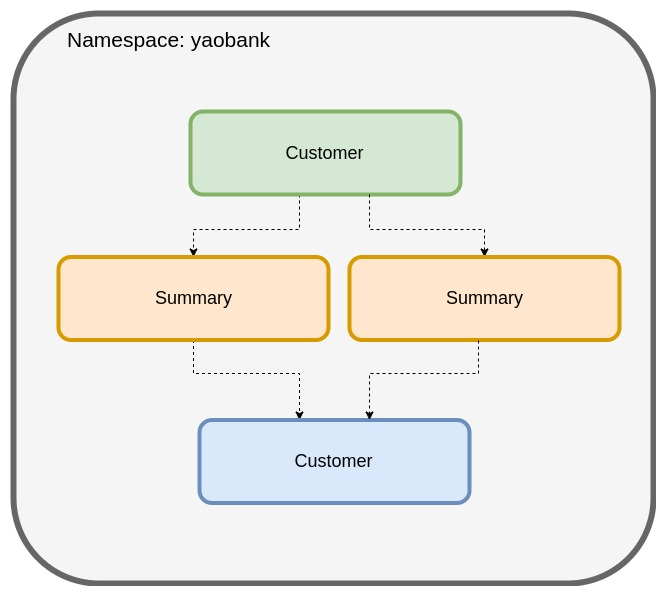

# 1. Lab1: Launch Yaobank app

The first lab guides you through the process of installing Calico and deploying a sample application. 

In this lab, you will:
1.1. Launch a sample application (Yaobank) 
1.2. Access the sample application frontend GUI

Make sure you have cloned the lab github repository below on the master node

login to your master node with the credentails given to you:
You can access master node at:

`http://<master-node-public-ip>:31000`

Enter credentials given to you for the lab.

Make sure you are in the righ directory

`cd ~`

Then clone the repository

`git clone https://github.com/tigera-cs/servicenow.git traininglabs`

`cd traininglabs`

Change into the lab directory:

`cd traininglabs/1-install-calico-k8s-lab`

Change `traininglabs` to the directory where you have clone the training labs repository.


## 1.1. Launch a sample application (yaobank)

For this lab, we will use a sample application called "Yet Another Online Bank" (yaobank) which consists of 3 microservices.
1. Customer (which provides a simple web GUI)
2. Summary (some middleware business logic)
3. Database (the persistent datastore for the bank)


The following diagram shows the logical diagram of the application.



### 1.2. Launch the application using the following commands

```
kubectl apply -f ./lab_manifests/1-yaobank.yaml
```

### 1.1.2. Check the status of the pods, wait until all are RUNNING status.
```
kubectl get pods -n yaobank
```

```
ubuntu@host1:~/calico-master/lab-manifests$ kubectl get pods -n yaobank
NAME                        READY   STATUS              RESTARTS   AGE
customer-5df6b999fb-qmbjz   1/1     Running             0          87s
database-7d4b6bf788-mgl2n   1/1     Running             0          87s
summary-6c755fccd5-mb54l    1/1     Running             0          87s
summary-6c755fccd5-s6b7w    1/1     Running             0          87s
```

### 1.1.3. You can also verify successful deployment with the `rollout status` command

```
kubectl rollout status -n yaobank deployment/customer
kubectl rollout status -n yaobank deployment/summary
kubectl rollout status -n yaobank deployment/database
```


## 1.2. Access the Sample Application Web GUI

Browse to the "Web Application" (http://masternodeip:30180) URL sent with your lab login details. You should see the bank balance for a user account.
 

> __Congratulations! You have completed your first lab.__

